 

---

---

## Selected Public Work

### ForgeLens

**Local-first repository intelligence for safer AI-assisted development.**

Scans repositories, maps risky areas, generates AI-ready context, and tracks baseline drift.

---

## Private Production Work

Most of my production SaaS and client work is private. I present my engineering scope, architecture decisions, and delivery standards without exposing client data, business logic, or internal implementation.

---

## Open to Remote Work

**Based in Morocco and open to international teams.**

